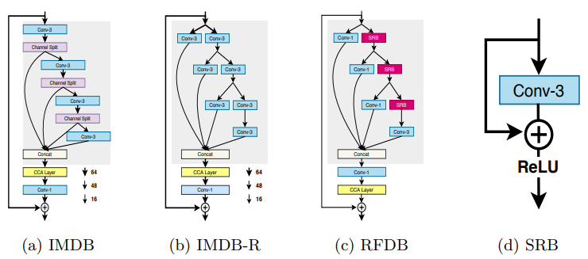

# RFDNet Super Resolution
Residual Feature Distillation Network for Lightweight Image Super-Resolution

## Content
- [RFDNet](#rfdnet-super-resolution)
- [Getting Started](#getting-tarted)
- [Running](#running)
- [References](#references)
- [Citations](#citation)

## Getting Started

- Clone the repository

### Prerequisites

- Tensorflow 2.2.0+
- Python 3.6+
- Keras 2.3.0
- PIL
- numpy

```python
pip install -r requirements.txt
```

## Running
### Training 

- Train RFDNet 
    ```
    python main.py
    ```

- Test RFDNet
    ```
    python test.py
    ```
## Usage

### Testing
<!-- Download the weight [here](https://drive.google.com/file/d/1OjJYirwRa8cLGzzdRYRkjq_1FokyI80V/view?usp=sharing) and put it to the folder. -->
```
usage: test.py [-h] [--test_path TEST_PATH] [--gpu GPU]
               [--weight_test_path WEIGHT_TEST_PATH] [--filter FILTER]
               [--feat FEAT] [--scale SCALE]
```
```
optional arguments:
                    -h, --help            show this help message and exit
                    --test_path TEST_PATH
                    --gpu GPU
                    --weight_test_path WEIGHT_TEST_PATH
                    --filter FILTER
                    --feat FEAT
                    --scale SCALE
```

#### Result
| Input - Low Res | Bilinear | Output High Res |
| --- | --- | --- |
|  |  | |
|  |  | |

## License

This project is licensed under the MIT License - see the [LICENSE](https://github.com/tuvovan/RFDNet-ImageSuperResolution/blob/master/LICENSE) file for details

## References
[1] Training and Testing dataset - [link](http://www.eecs.berkeley.edu/Research/Projects/CS/vision/grouping/BSR/BSR_bsds500.tgz)

## Citation
```
@misc{liu2020residual,
      title={Residual Feature Distillation Network for Lightweight Image Super-Resolution}, 
      author={Jie Liu and Jie Tang and Gangshan Wu},
      year={2020},
      eprint={2009.11551},
      archivePrefix={arXiv},
      primaryClass={eess.IV}
}
```
## Acknowledgments
- Any ideas on updating or misunderstanding, please send me an email: <vovantu.hust@gmail.com>
- If you find this repo helpful, kindly give me a star.

